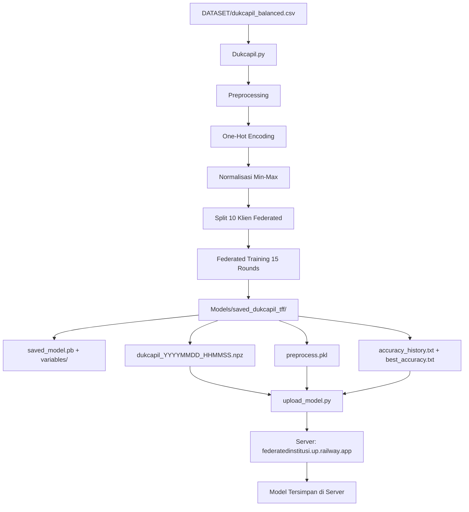

# Dukcapil - Federated Learning untuk Klasifikasi Kelayakan Subsidi

Repository ini berisi implementasi Federated Learning untuk klasifikasi kelayakan subsidi berdasarkan data kependudukan dan pencatatan sipil (Dukcapil).

---

## 📁 Struktur Dataset

Dataset terletak di direktori `DATASET/` dengan struktur sebagai berikut:

### File Dataset
- **Lokasi**: `DATASET/dukcapil_balanced.csv`
- **Jumlah Baris**: 100,002 records
- **Ukuran**: ~4.5 MB

### Kolom Dataset

Dataset terdiri dari **10 kolom** dengan rincian sebagai berikut:

| Kolom | Tipe Data | Deskripsi | Nilai Contoh |
|-------|-----------|-----------|--------------|
| `nik_valid` | Kategorikal | Validitas NIK | ya, tidak |
| `memiliki_kk` | Kategorikal | Kepemilikan Kartu Keluarga | ya, tidak |
| `domisili_tetap` | Kategorikal | Status domisili tetap | ya, tidak |
| `data_ganda` | Kategorikal | Indikator data duplikat | ya, tidak |
| `masuk_dtks` | Kategorikal | Terdaftar di DTKS | ya, tidak |
| `status_perkawinan` | Kategorikal | Status perkawinan | menikah, duda, janda |
| `pekerjaan_kepala_keluarga` | Kategorikal | Pekerjaan kepala keluarga | buruh, petani, tidak bekerja |
| `jumlah_anggota_kk` | Numerik | Jumlah anggota dalam KK | 3-6 |
| `usia_kepala_keluarga` | Numerik | Usia kepala keluarga | 25-59 |
| `layak_subsidi` | Target | Label klasifikasi (0/1) | 0 = Tidak Layak, 1 = Layak |

### Karakteristik Dataset
- **Dataset Balanced**: Data sudah diseimbangkan antara kelas layak dan tidak layak subsidi
- **Fitur Kategorikal**: 7 kolom kategorikal (ya/tidak dan kategori pekerjaan/status)
- **Fitur Numerik**: 2 kolom numerik (jumlah anggota KK dan usia)
- **Preprocessing**: One-hot encoding dilakukan pada fitur kategorikal

---

## 🚀 Training Local dengan `Dukcapil.py`

### Prasyarat

Pastikan library berikut terinstal:

```bash
pip install numpy pandas tensorflow tensorflow-federated joblib
```

### Langkah-langkah Training

#### 1. Persiapan File Global Features

Sebelum menjalankan training, pastikan file `Models/fitur_global.pkl` sudah tersedia. File ini berisi daftar fitur global yang digunakan untuk alignment fitur antar klien.

#### 2. Menjalankan Training

Jalankan script training dengan perintah:

```bash
python Dukcapil.py
```

#### 3. Proses Training

Script akan melakukan tahapan berikut:

1. **Load Dataset**
   - Membaca file `DATASET/dukcapil_balanced.csv`
   - Menampilkan jumlah baris dan kolom

2. **Preprocessing**
   - Memisahkan fitur (X) dan target (y)
   - Menghapus kolom ID dan timestamp
   - One-hot encoding pada fitur kategorikal
   - Alignment fitur dengan `fitur_global.pkl`
   - Normalisasi Min-Max scaling

3. **Federated Learning Setup**
   - Membagi data menjadi **10 klien** federated
   - Batch size: **32**
   - Jumlah rounds: **15**

4. **Model Architecture**
   ```
   Input Layer (FEATURE_DIM)
   ├── Dense(128, relu)
   ├── BatchNormalization
   ├── Dropout(0.3)
   ├── Dense(64, relu)
   ├── Dense(32, relu)
   └── Dense(1, sigmoid)
   ```

5. **Federated Training**
   - Optimizer Client: Adam (lr=0.005)
   - Optimizer Server: Adam (lr=0.01)
   - Loss Function: Binary Crossentropy
   - Metrics: Binary Accuracy

6. **Output Training**
   - Progress setiap round ditampilkan:
     ```
     [DUKCAPIL] Round 01 | acc=0.8234 | loss=0.4123
     [DUKCAPIL] Round 02 | acc=0.8456 | loss=0.3891
     ...
     ```

---

## 💾 Model yang Dihasilkan

Setelah training selesai, model dan metadata akan disimpan di direktori `Models/saved_dukcapil_tff/`:

### File-file yang Dihasilkan

| File/Folder | Deskripsi |
|-------------|-----------|
| `saved_model.pb` | Model TensorFlow SavedModel format |
| `variables/` | Folder berisi weights model |
| `dukcapil_YYYYMMDD_HHMMSS.npz` | Model weights dalam format NPZ (compressed) |
| `preprocess.pkl` | File preprocessing: fitur kolom, mins, range untuk normalisasi |
| `accuracy_history.txt` | Log history accuracy dan loss per round dengan timestamp |
| `best_accuracy.txt` | Best accuracy yang dicapai selama training |

### Contoh Struktur Output

```
Models/
└── saved_dukcapil_tff/
    ├── saved_model.pb
    ├── variables/
    │   ├── variables.data-00000-of-00001
    │   └── variables.index
    ├── dukcapil_20260108_150530.npz
    ├── preprocess.pkl
    ├── accuracy_history.txt
    └── best_accuracy.txt
```

### Isi File Penting

#### `preprocess.pkl`
File joblib yang berisi dictionary:
```python
{
    "FEATURE_COLS": [...],  # List fitur dalam urutan yang benar
    "mins": ...,            # Nilai minimum untuk normalisasi
    "rng": ...              # Range (max-min) untuk normalisasi
}
```

#### `accuracy_history.txt`
Format:
```
round	accuracy	loss	timestamp
1	0.823456	0.412345	2026-01-08T08:05:30.123456Z
2	0.845678	0.389123	2026-01-08T08:06:15.789012Z
...
```

---

## 📡 Upload Model ke Server

### Konfigurasi Server

File `upload_model.py` digunakan untuk mengirim model ke server federated.

**Konfigurasi Server:**
- **URL Server**: `https://federatedinstitusi.up.railway.app`
- **Client Name**: `dukcapil`
- **Endpoint**: `/upload-model`

### Langkah Upload

#### 1. Pastikan Model Sudah Ada

Model harus sudah di-train dan tersimpan di `Models/saved_dukcapil_tff/`

#### 2. Jalankan Upload Script

```bash
python upload_model.py
```

#### 3. Proses Upload

Script akan melakukan:

1. **Load Model Lokal**
   - Mencoba load Keras model dari `models/saved_dukcapil_tff`
   - Jika gagal, akan menggunakan TFSMLayer

2. **Pengecekan/Pembuatan NPZ**
   - Mencari file NPZ terbaru: `dukcapil_*.npz`
   - Jika belum ada, akan membuat dari model Keras
   - Validasi jumlah weights (harus 12 tensor)

3. **Load Metadata**
   - Membaca `best_accuracy.txt`
   - Membaca 10 baris terakhir dari `accuracy_history.txt`

4. **Encoding dan Upload**
   - Encode NPZ file ke base64
   - Kirim POST request ke server dengan payload:
     ```json
     {
       "client": "dukcapil",
       "compressed_weights": "<base64_encoded_npz>",
       "framework": "tensorflow",
       "model_version": "v1.0",
       "metrics": {
         "best_accuracy": 0.8567,
         "history_tail": [...]
       }
     }
     ```

5. **Retry Mechanism**
   - Timeout: 180 detik
   - Maksimal retry: 3 kali
   - Delay antar retry: 3 detik

#### 4. Output Upload

**Sukses:**
```
✅ Upload sukses (45.23 detik)
📨 Server response: {'status': 'success', 'message': 'Model uploaded'}
🎉 Model DUKCAPIL berhasil dikirim ke server!
```

**Gagal:**
```
❌ Gagal upload: Connection timeout
❌ Model DUKCAPIL gagal dikirim.
```

---

## 🔧 Workflow Lengkap

Berikut adalah workflow lengkap dari dataset hingga upload model:



---

## 📊 Monitoring dan Evaluasi

### Melihat Progress Training

Selama training, monitor output console untuk melihat accuracy dan loss per round:

```
🚀 TRAINING START
[DUKCAPIL] Round 01 | acc=0.8234 | loss=0.4123
[DUKCAPIL] Round 02 | acc=0.8456 | loss=0.3891
...
[DUKCAPIL] Round 15 | acc=0.9123 | loss=0.2345
```

### Melihat Best Accuracy

Setelah training selesai, lihat file `Models/saved_dukcapil_tff/best_accuracy.txt`:

```bash
cat Models/saved_dukcapil_tff/best_accuracy.txt
```

### Analisis History

Analisis history training dari `accuracy_history.txt` untuk melihat trend improvement:

```bash
cat Models/saved_dukcapil_tff/accuracy_history.txt
```

---

## ⚠️ Troubleshooting

### Error: `fitur_global.pkl tidak ditemukan`

**Solusi**: Pastikan file `Models/fitur_global.pkl` sudah ada. File ini berisi daftar fitur global yang harus dibuat sebelum training.

### Error: Upload gagal - Connection Timeout

**Solusi**:
1. Periksa koneksi internet
2. Pastikan server `federatedinstitusi.up.railway.app` aktif
3. Coba lagi dengan menjalankan `upload_model.py`

### Error: Jumlah weight tidak sesuai

**Solusi**: 
- Model harus memiliki 12 tensor weights
- Pastikan arsitektur model tidak diubah
- Re-train model jika diperlukan

---

## 📝 Catatan Penting

1. **Dataset Balanced**: Dataset sudah diseimbangkan, cocok untuk klasifikasi binary
2. **Federated Learning**: Data dibagi ke 10 klien untuk simulasi federated learning
3. **Preprocessing Consistency**: File `preprocess.pkl` penting untuk inference, jangan dihapus
4. **Model Format**: Model tersimpan dalam 2 format:
   - SavedModel (`.pb`) untuk deployment
   - NPZ (`.npz`) untuk upload ke server federated

---

## 🔗 Dependencies

```
numpy
pandas
tensorflow >= 2.x
tensorflow-federated
joblib
requests
```

---

## 📧 Kontak

Untuk pertanyaan lebih lanjut mengenai implementasi Federated Learning Dukcapil, silakan hubungi tim pengembang.
