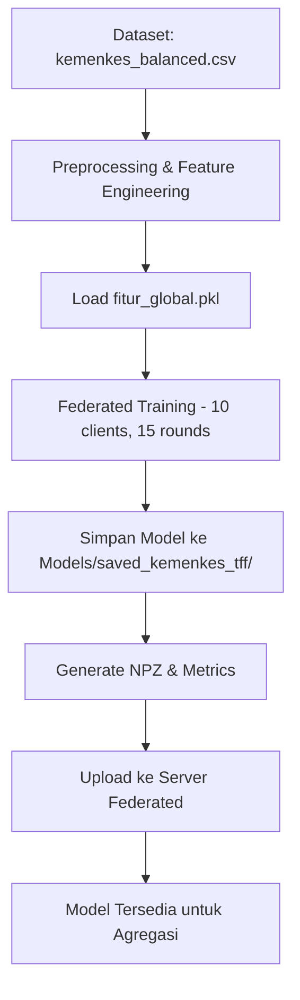

# Kemenkes Federated Learning Model

Proyek ini mengimplementasikan **Federated Learning** untuk prediksi kelayakan subsidi kesehatan (subsidi ledger) menggunakan TensorFlow Federated (TFF). Model dilatih secara lokal dan dapat diupload ke server untuk agregasi federated.

---

## 📁 Struktur Dataset

Dataset terletak di direktori `DATASET/` dengan struktur sebagai berikut:

```
DATASET/
└── kemenkes_balanced.csv
```

### Format Data

File `kemenkes_balanced.csv` berisi data yang telah seimbang (balanced) dengan kolom-kolom berikut:

| Kolom | Deskripsi |
|-------|-----------|
| `penghasilan` | Penghasilan individu |
| `punya_asuransi_lain` | Status kepemilikan asuransi lain |
| `penyakit_kronis` | Riwayat penyakit kronis |
| `status_pekerjaan` | Status pekerjaan saat ini |
| `kondisi_tempat_tinggal` | Kondisi tempat tinggal |
| `akses_ke_faskes` | Tingkat akses ke fasilitas kesehatan |
| `status_gizi` | Status gizi individu |
| **`layak_subsidi`** | Label target (0/1) - kelayakan menerima subsidi |

> **Catatan**: Kolom `layak_subsidi` adalah target variable untuk klasifikasi biner.

---

## 🚀 Training Lokal

### Prasyarat

Pastikan Anda telah menginstall dependencies berikut:

```bash
pip install numpy pandas tensorflow tensorflow-federated joblib
```

### File `fitur_global.pkl`

Sebelum training, pastikan file `Models/fitur_global.pkl` sudah ada. File ini berisi:
- **Daftar fitur global** yang diselaraskan (aligned) untuk semua client
- Digunakan untuk memastikan konsistensi dimensi fitur antar client

> **Penting**: Jika file ini belum ada, jalankan terlebih dahulu script pembuat fitur global sebelum training.

### Menjalankan Training

Jalankan perintah berikut untuk memulai training:

```bash
python kemenkes.py
```

### Proses Training

Script `kemenkes.py` melakukan langkah-langkah berikut:

1. **Load Dataset**
   - Membaca `DATASET/kemenkes_balanced.csv`
   - Memisahkan fitur dan label (`layak_subsidi`)
   - Menghapus kolom ID dan timestamp

2. **Preprocessing**
   - Memuat fitur global dari `Models/fitur_global.pkl`
   - One-hot encoding untuk fitur kategorikal
   - Alignment fitur dengan menambahkan kolom yang hilang
   - Normalisasi Min-Max untuk semua fitur

3. **Federated Learning Setup**
   - Membagi data menjadi **10 client** secara acak
   - Setiap client memiliki batch size **32**
   - Training dilakukan selama **15 rounds**

4. **Arsitektur Model**
   ```
   Input Layer (sesuai dimensi fitur global)
   ├─ Dense(128, relu)
   ├─ BatchNormalization
   ├─ Dropout(0.3)
   ├─ Dense(64, relu)
   ├─ Dense(32, relu)
   └─ Dense(1, sigmoid)
   ```

5. **Optimasi**
   - **Client Optimizer**: Adam (learning rate = 0.005)
   - **Server Optimizer**: Adam (learning rate = 0.01)
   - **Loss Function**: Binary Crossentropy
   - **Metric**: Binary Accuracy

### Output Training

Training akan menampilkan log seperti berikut:

```
=== TRAINING FEDERATED KEMENKES ===
📂 Load dataset: DATASET/kemenkes_balanced.csv
✅ 10,000 baris | 7 kolom
🔑 Total fitur global: 45
🔧 One-hot encoding & align fitur...
🔧 Normalisasi Min-Max...
✅ Preprocessing selesai
👥 10 klien federated siap

🚀 TRAINING START
[KEMENKES] Round 01 | acc=0.7234 | loss=0.5432
[KEMENKES] Round 02 | acc=0.7456 | loss=0.5123
...
[KEMENKES] Round 15 | acc=0.8512 | loss=0.3421

✅ TRAINING SELESAI
📂 Model        : Models/saved_kemenkes_tff
🏆 Best Acc     : 0.8512
📈 History file : accuracy_history.txt
💾 Weights NPZ  : kemenkes_20251216_105100.npz
```

---

## 💾 Model yang Dihasilkan

Setelah training selesai, model disimpan di direktori `Models/saved_kemenkes_tff/` dengan struktur:

```
Models/saved_kemenkes_tff/
├── saved_model.pb              # Model TensorFlow SavedModel
├── keras_metadata.pb           # Metadata Keras
├── fingerprint.pb              # Fingerprint model
├── variables/                  # Bobot model dalam format TF
│   ├── variables.data-00000-of-00001
│   └── variables.index
├── assets/                     # Asset tambahan (jika ada)
├── kemenkes_YYYYMMDD_HHMMSS.npz  # Bobot dalam format NPZ (compressed)
├── preprocess.pkl              # Parameter preprocessing (mins, rng, feature_cols)
├── accuracy_history.txt        # Riwayat akurasi per round
└── best_accuracy.txt           # Akurasi terbaik
```

### Deskripsi File

| File | Deskripsi |
|------|-----------|
| `saved_model.pb` | Model lengkap dalam format TensorFlow SavedModel |
| `variables/` | Bobot (weights) model dalam format TensorFlow |
| `kemenkes_*.npz` | Bobot model dalam format NumPy compressed (untuk upload) |
| `preprocess.pkl` | Parameter preprocessing:<br>- `FEATURE_COLS`: Daftar nama fitur<br>- `mins`: Nilai minimum untuk normalisasi<br>- `rng`: Range untuk normalisasi |
| `accuracy_history.txt` | Log riwayat training (round, accuracy, loss, timestamp) |
| `best_accuracy.txt` | Akurasi terbaik yang dicapai selama training |

---

## 📤 Upload Model ke Server

### Konfigurasi Server

File `upload_model.py` dikonfigurasi untuk mengirim model ke server federated:

- **Server URL**: `https://federatedinstitusi.up.railway.app`
- **Client Name**: `kemenkes`
- **Endpoint**: `/upload-model`

### Menjalankan Upload

Setelah training selesai, jalankan:

```bash
python upload_model.py
```

### Proses Upload

Script `upload_model.py` melakukan:

1. **Mencari Model**
   - Mengecek apakah file NPZ sudah ada di `models/saved_kemenkes_tff/`
   - Jika belum ada, membuat NPZ dari model SavedModel

2. **Validasi Weight**
   - Memastikan jumlah weight tensor = **12** (sesuai arsitektur model)
   - Format: Dense + BN + Dense + Dense

3. **Persiapan Payload**
   - Encode bobot NPZ ke base64
   - Menambahkan metadata:
     - `client`: "kemenkes"
     - `framework`: "tensorflow"
     - `model_version`: "v1.0"
     - `metrics`: Best accuracy dan history

4. **Upload dengan Retry**
   - Timeout: **180 detik**
   - Retry maksimal: **3 kali**
   - Jeda antar retry: **3 detik**

### Output Upload

Upload yang berhasil akan menampilkan:

```
✅ Bobot ditemukan: kemenkes_20251216_105100.npz (0.07 MB)
🔎 Validasi weight: 12 tensor
📡 Upload model (kemenkes) percobaan 1...
✅ Upload sukses (12.34 detik)
📨 Server response: {'status': 'success', 'message': 'Model uploaded'}

🎉 Model KEMENKES berhasil dikirim ke server!
```

---

## 🔧 Troubleshooting

### Error: `fitur_global.pkl tidak ditemukan`

**Solusi**: Jalankan script pembuat fitur global terlebih dahulu untuk menghasilkan file ini.

### Error: `Jumlah weight tidak sesuai`

**Solusi**: Pastikan arsitektur model di `kemenkes.py` dan `upload_model.py` konsisten (EXPECTED_WEIGHTS = 12).

### Error: Upload timeout

**Solusi**: 
- Periksa koneksi internet
- Server mungkin sedang busy, coba lagi beberapa saat
- Timeout dapat ditingkatkan di `TIMEOUT` variable

---

## 📊 Monitoring

### Melihat History Training

```bash
cat Models/saved_kemenkes_tff/accuracy_history.txt
```

Format output:
```
round   accuracy    loss        timestamp
1       0.723400    0.543200    2025-01-08T15:00:00Z
2       0.745600    0.512300    2025-01-08T15:02:00Z
...
```

### Memeriksa Best Accuracy

```bash
cat Models/saved_kemenkes_tff/best_accuracy.txt
```

---

## 📝 Catatan Penting

1. **Konsistensi Fitur**: Semua client harus menggunakan `fitur_global.pkl` yang sama untuk memastikan dimensi fitur konsisten
2. **Format Data**: Dataset harus dalam format CSV dengan kolom `layak_subsidi` sebagai target
3. **Preprocessing**: Parameter preprocessing (mins, rng) disimpan untuk digunakan saat inference
4. **Client Name**: Nama client "kemenkes" harus lowercase dan konsisten antara training dan upload

---

## 🔗 Workflow Lengkap



---


